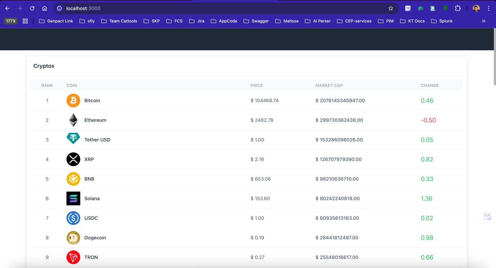
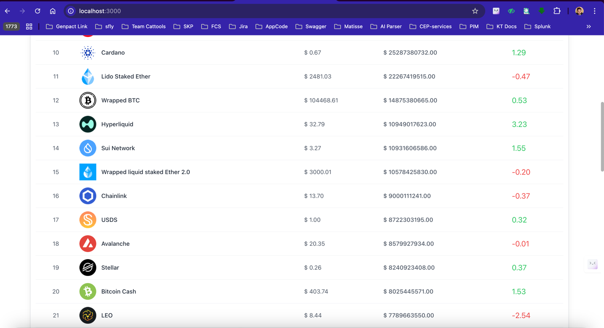
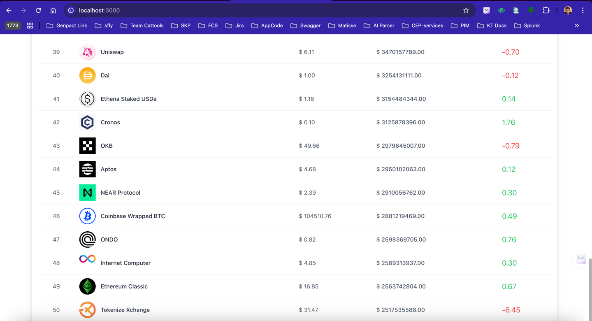
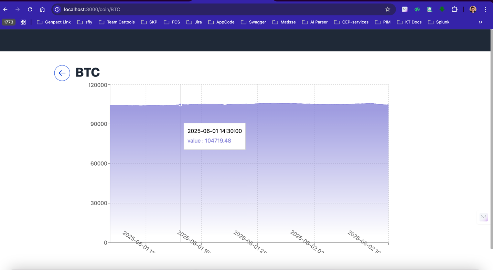
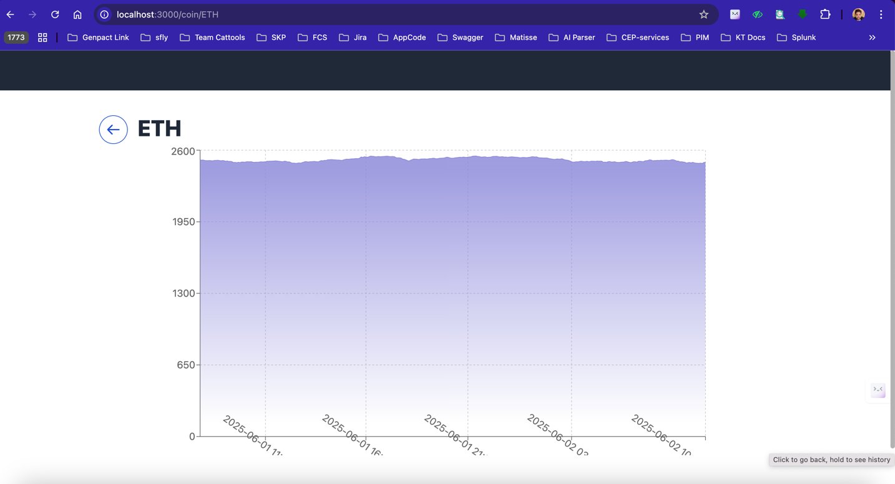
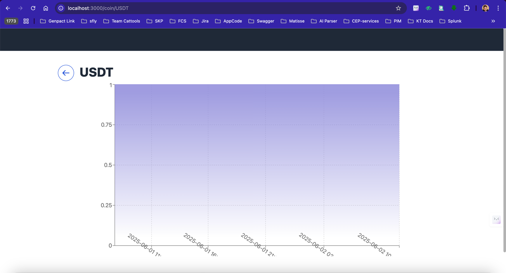
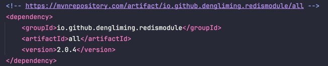
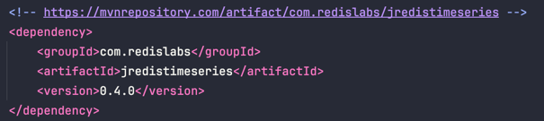
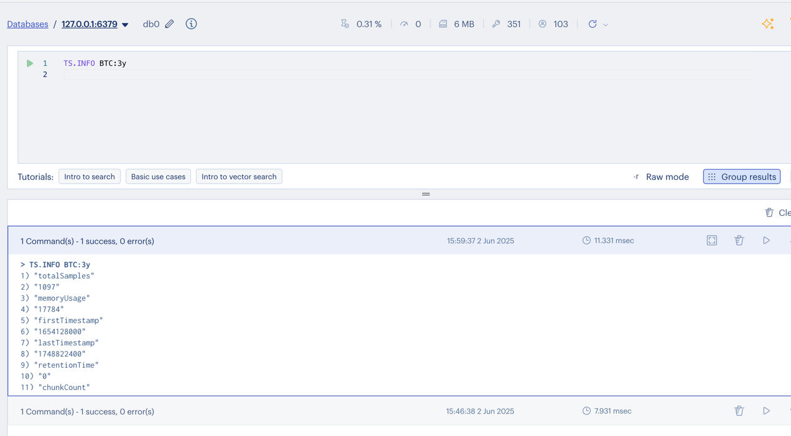
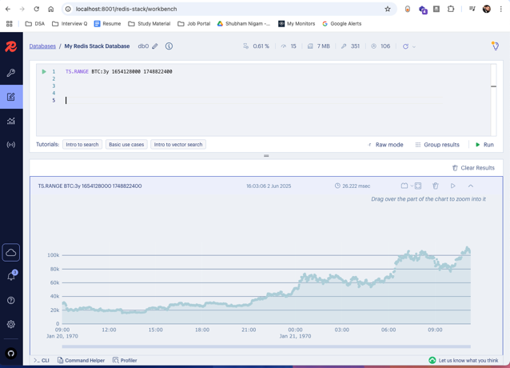

# crypto-ranking-service-springboot-redis-2025

### 1. This is home page where we can see list of all top 50 Crypto coins




### 2. We can choose any coin and can see the Time Series of the price of particular coin




1. Backend Code running at : localhost:1001
2. UI Code running at : localhost:3000

### 3. Create a project




### 4. Docker commands
###### first time
```
docker run -d --name redis-stack-server -p 6379:6379 -p 8001:8001 redis/redis-stack:latest
```
###### second time
```
docker run redis-stack-server    
```


### 5. Some redis-insight commands 

